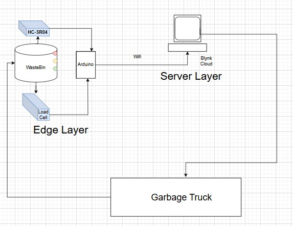

# 24CYS333 - Internet of Things
  
 
    

## IoT#02 - Smart Waste Bin Monitoring and Route Optimization for Garbage Collection

       
   
 

---
### Problem Statement
Design a smart waste management system that utilizes sensor-equipped waste bins to monitor real-time waste levels and use the collected data to optimize waste collection routes, considering factors such as collection frequency, distance, waste volume, fuel efficiency, and potential waste stagnation. 

---
### Hardware Requirements

| Hardware |  Name  | Purpose |
|:-----|:--------:|:--------|
| Ultrasonic sensors   | HC-SR04 | Measures the real-time waste levels in the bin by detecting the distance between the sensor and the waste.
| Weight Sensors   |  Load Cells  | Measures the total weight of the waste in the bin, offering an additional parameter to complement the ultrasonic sensor readings.
| Microcontroller   | Arduino MKR WiFi 1010 | Processes sensor data, manages power, and communicates with a central server or cloud platform using its WiFi capabilities.
| Power Supply | LiPo Battery | Provides a reliable and portable power source for the sensors and microcontroller, especially in outdoor or remote locations.
| Indicators | LED Indicators (Red, yellow and green) |Provide a simple, visual indication of the bin's status for nearby users or waste collectors.

---
### Literature Survey 
- We have read two papers “IoT-Enabled Smart Waste Management: A Comprehensive Study on Sensor Technologies and Implementation Strategies” and "IoT-Enabled Intelligent Garbage Management System for Smart City: A Fairness Perspective". Both propose solutions for a smart bin management and route optimization.

- Both the papers use the LoRa technology for communication as it is the most cost-effective and energy-efficient communication protocol for long-range data transmission. The other methods like GSM, WiFi and ZigBee were also mentioned, but, LoRa remains the best protocol for the proposed system due to its scalability, energy efficiency, and affordability. So we have decided on using the LoRa technology for communication.

- Both papers emphasize IoT-enabled sensors (e.g., ultrasonic and weight sensors) for real-time monitoring of bin statuses.

- The first paper uses IoTBinCap algorithm for bin capacity optimization, prioritizing route efficiency. The second paper proposes the Fairness-Based Optimum Solution (FBOS) algorithm. We haven’t decided on which algorithm to use yet as both of these have their own merits and demerits.

- The major two challenges encountered by the papers are the issues with scalability and the LoRa’s decrease in packet delivery rate with increase in device numbers.The solution suggested for LoRa’s packet delivery rate decrease is to use LoRa gateways strategically to enhance scalability.Solar panels or LiPo batteries can be adopted for sustainable power supply.

---
### Proposed Solution
The proposed solution involves the strategic deployment of LoRa gateways using optimization techniques to ensure efficient coverage and minimize congestion. The waste bins, equipped with sensors, transmit real-time data to the nearest gateways, which forward the information to a central server for processing. This server aggregates data on waste levels, bin locations, and fill status, analyzing it to determine the most efficient collection routes. While the specific algorithm for route optimization has yet to be finalized, the system will prioritize factors like distance, collection frequency, foot traffic, and waste volume to optimize efficiency.

---
### Use Cases
#### Smart Cities 
Municipal corporations can deploy IoT-enabled smart bins to monitor waste levels in
real time and optimize garbage collection routes, reducing fuel consumption and labor
costs.
#### ATM Cash refill optimization 
Refill teams take the most efficient routes, prioritizing ATMs that are running low
instead of following a fixed schedule.
#### College/University campuses ✅
Educational institutions can implement smart waste bins to maintain cleaner
campuses, optimize cleaning staff efforts, and track waste generation patterns for
sustainability initiatives.

---
### Architecture Diagram

---
### Deliverables:
A web application that visualizes collected data, updates path information and associated costs, accounts for relevant factors, and displays or outputs the optimized route.

---
### Mapping the Project to Relevant Sustainable Development Goals (SDGs)
| SDG | Alignment |
|:---|:----------|
| Goal 9 - Industry, Innovation, and Infrastructure | Promotes efficient waste management, reducing urban waste overflow, enhancing cleanliness, lowering carbon footprints, and leveraging data-driven insights to improve urban aesthetics and enables smarter waste management strategies. |
| Goal 11 - Sustainable Cities and Communities | Leveraging IoT and analytics to modernize waste management, optimize collection processes, and enhance infrastructure efficiency, resilience, and cost-effectiveness. |

---
### References
- Sankar, G. R., & Fathima, G. (2024). **IOT-Enabled Smart Waste Management: A comprehensive study on sensor technologies and implementation strategies.** _2022 International Conference on Inventive Computation Technologies (ICICT)_.
- Rahman, M. A., Tan, S. W., Asyhari, A. T., Kurniawan, I. F., Alenazi, M. J. F., & Uddin, M. (2024). **IoT-Enabled Intelligent Garbage Management System for Smart City: A Fairness Perspective**. _IEEE Access_, 12, 82693–82705.
- Dharan, P., & Manikandan, V. M. (2024). **A Smart Waste Management System with Optimized Routing Method**. _2022 13th International Conference on Computing Communication and Networking Technologies (ICCCNT)_, 1–6. 
