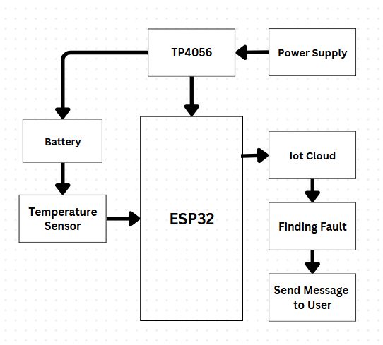

# 24CYS333 - Internet of Things
  
 
    

## IoT#17 - IoT-Based Battery Monitoring System for Electric Vehicles
       
    

---

### Problem Statement

The growing reliance on battery-powered devices, particularly in IoT-based applications, has raised concerns about battery health, performance, and efficient management. Traditional battery monitoring systems lack real-time tracking, remote access, and automated management features. This leads to issues such as overcharging, undercharging, and inefficient energy consumption, reducing the lifespan and reliability of batteries.

---

### Hardware Requirements

The system requires the following components:

| **Component**         | **Purpose**                                                                                         |
|------------------------|---------------------------------------------------------------------------------------------------------|
| **IR Sensor**          | Detects proximity or movement, used for detecting vehicle presence.                                     |
| **Lithium-Ion Battery**| Simulates the vehicle's battery for monitoring purposes.                                                |
| **LCD**                | Displays battery performance, including voltage, current, and other parameters.                         |
| **Relay**              | Acts as a switch to control the connection or disconnection of the battery circuit for safety or testing purposes. |
| **TP4056 Module**      | Charging module for safely charging the Lithium-Ion battery.                                            |
| **ESP8266**            | Microcontroller used for IoT connectivity, enabling the project to transmit battery health data wirelessly. |
| **LED**                | Indicates the status of the battery (e.g., charging, fully charged, or error).                          |
| **Resistors**          | Used to regulate current and voltage in the circuit.                                                   |
| **Connecting Wires**   | Facilitate connections between components.                                                             |

---

### Literature Survey

The "IoT-Based Battery Monitoring System for Electric Vehicles" focuses on leveraging Internet of Things (IoT) technologies for real-time battery health monitoring, remote management, and efficient energy utilization. The survey highlights the following areas:

#### State-of-the-Art Monitoring Systems
- Traditional battery monitoring systems are inadequate for contemporary IoT and electric vehicle requirements.
- Issues such as overcharging, undercharging, and lack of remote management capabilities are prevalent, reducing battery reliability and lifespan.

#### Advancements in IoT
- IoT components like Arduino UNO, ESP8266, and sensors enable real-time data collection and remote access.
- Wireless communication and automated management systems improve battery life and operational efficiency.

#### Challenges

Key challenges in implementing the system include:
- Ensuring accurate real-time monitoring of battery health.
- Seamlessly integrating wireless communication.
- Efficiently managing power consumption.
- Ensuring safe charging processes for lithium-ion batteries.
- Handling network connectivity issues.
- Maintaining system reliability and stability, especially in dynamic or remote environments.

---

### Proposed Solution
The proposed IoT-Based Battery Surveillance and Management System aims to address these challenges by providing:
- Real-time monitoring of battery health.
- Remote management via a web or mobile interface.
- Enhanced performance and longevity of IoT device power sources.

#### Scope
-  **IoT-Based Lithium-Ion Battery Health Monitoring & Management:** Develop an IoT system for remote monitoring and management of lithium-ion battery health, enabling automated charging and real-time data analysis to enhance battery life, optimize energy consumption, and ensure safety.

- **Applications in Electric Vehicles, Renewable Energy Systems & Portable Devices:** Implement the system across various applications, such as electric vehicles, renewable energy systems, and portable devices, to ensure efficient energy use, prolonged battery lifespan, and reliable performance

---

### Use Cases
####  Electric Vehicles (EV) Battery Management ✅
The system monitors EV battery health in real time, tracking voltage, temperature, and charge cycles. Data is sent to a cloud dashboard for remote monitoring and predictive maintenance. Alerts prevent overcharging, deep discharging, and overheating. Optimized charging cycles extend battery life and improve efficiency. This enhances EV performance, safety, and sustainability.

#### Renewable Energy Storage Monitoring
The system manages battery storage in solar and wind energy setups, preventing inefficiencies like overcharging or deep discharge. It provides real-time data to optimize energy consumption and storage. Alerts notify users of issues, ensuring safe and efficient operation. By improving battery lifespan, the system boosts renewable energy reliability. This reduces energy waste and promotes sustainability.

#### Smart Battery Management in IoT Devices
The system tracks battery usage in smart home devices, optimizing power consumption. It sends alerts for charging or replacement, preventing unexpected shutdowns. Automated power adjustments extend battery life and improve efficiency. Users benefit from reliable, long-lasting IoT devices. This enhances convenience and reduces energy consumption.

---

### System Architecture Diagram

---

### Mapping the Project to Relevant Sustainable Development Goals (SDGs)

| **Sustainable Development Goal (SDG)** | **Alignment**                                                                                       |
|-----------------------------------------|---------------------------------------------------------------------------------------------------------------|
| **SDG 7: Affordable and Clean Energy**  | Promotes efficient battery energy management to optimize consumption. Extends battery life, reducing waste and costs associated with frequent replacements. |
| **SDG 9: Industry, Innovation, and Infrastructure** | Introduces IoT-based innovations for battery health monitoring. Enhances infrastructure reliability in electric vehicles and renewable energy systems. |
| **SDG 12: Responsible Consumption and Production** | Encourages sustainable battery usage and disposal practices. Reduces energy waste through real-time monitoring and automated processes. |

---

### Reference
- Karthikeyen, S., Priya, C. K., Varshini, M., Swathi, P., & Sudharsan, S. (2024). **IoT-Based Wireless Battery Surveillance and Management System. Journal of Electronics and Informatics** 6, (2), 117-130.
